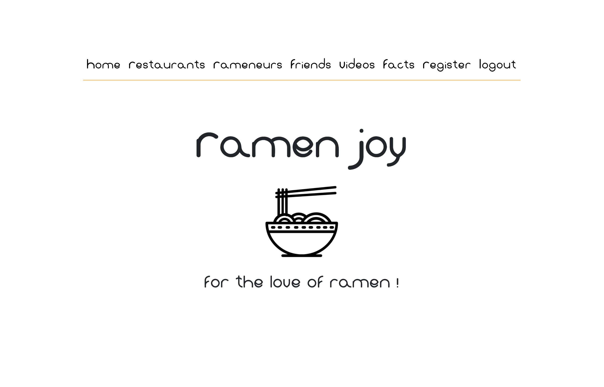
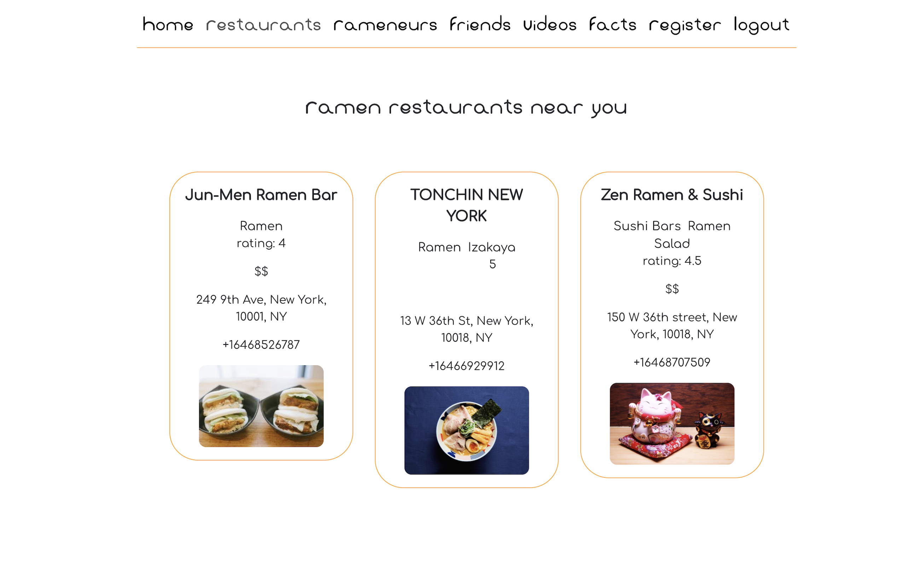
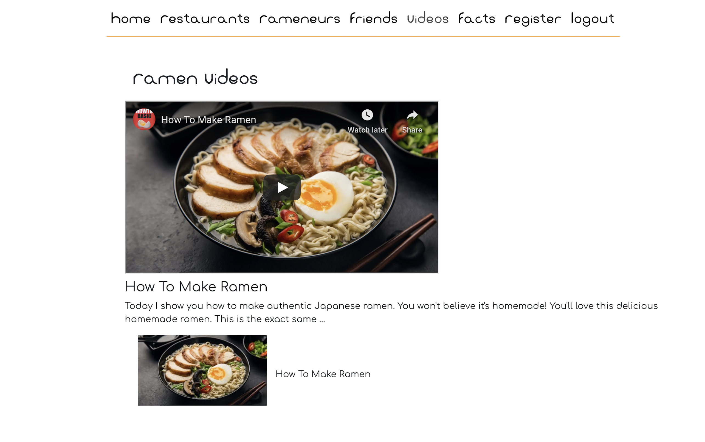

# ramen joy
Ramen lover's paradise.

## Description

Ramen Joy is an app for lovers of ramen. The app provides information on ramen, how to make ramen, where to find the best ramen in your area and who to eat it with.

## User Stories

Persona: Frank loves ramen! He loves to eat it but he doesn't know much about it. He has a favorite ramen restaurant in NYC, where he lives, but wants to find more. And, he wants to find people to eat Ramen with. Our app will help Frank learn about Ramen, where to find the best ramen spots and who he can eat ramen with. He may just meet the ramen lover of his dreams!

Persona: Alex is a student at a coding bootcamp! He spends 12+ hours per day in front of the computer coding and doesn’t have extra time to go out to meet people....but he REALLY wants to. He enjoys ramen and would love to incorporate his meal time with his social time. Our app will help Alex find fellow ramen enthusiasts to enjoy ramen with or maybe something MORE~ <3

Persona: LN loves having ramen with her bf, but her bf just turned vegan! She wants to be supportive so she is always looking for the next best vegan ramen recipe. Our app will provide her with many vegan ramen recipes to search through till she finds her favorite one!

## Team

Juju  |  Sasha  |  Alex  | Chris

## Deployed on Heroku

[https://stark-shelf-28495.herokuapp.com/](https://stark-shelf-28495.herokuapp.com/)

